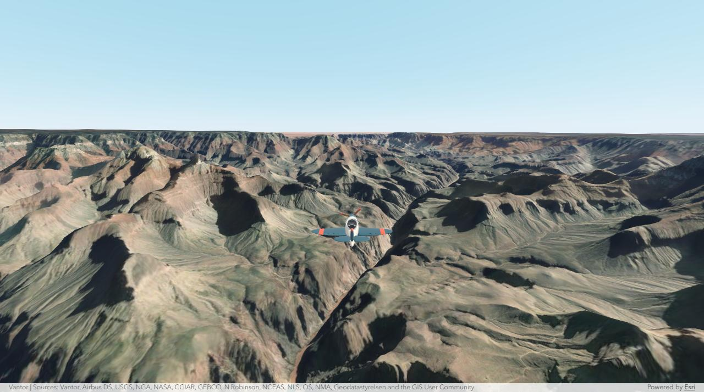

# ArcGIS Flight Component

A web component that lets you fly a plane through 3D scenes built with the
[ArcGIS Maps SDK for JavaScript](https://developers.arcgis.com/javascript/latest/).
Put `<arcgis-plane-navigation>` next to your scene, then steer with the
keyboard, a gamepad, or a touch joystick.



**[Documentation](https://ceddc.github.io/arcgis-flight-component/)** ·
**[Samples](https://ceddc.github.io/arcgis-flight-component/samples.html)** ·
**[API reference](https://ceddc.github.io/arcgis-flight-component/api-reference.html)**

> [!NOTE]
> This is a personal, for-fun project, built with help from ChatGPT and Claude.
> It is not an official Esri product, and the API may change before 1.0.
> Issues and ideas are welcome.

## Quick start

Install the component and the ArcGIS SDK:

```bash
npm install github:ceddc/arcgis-flight-component @arcgis/core@~5.1.24 @arcgis/map-components@~5.1.24
```

Import both components in your JavaScript entry point:

```js
import "@arcgis/map-components/components/arcgis-scene";
import "@ceddc/arcgis-flight-component";
```

Add a scene and point the flight component at it:

```html
<arcgis-scene id="scene" basemap="satellite" ground="world-elevation"
  camera-position="7.71, 46.01, 5600" camera-heading="235" camera-tilt="78">
</arcgis-scene>
<arcgis-plane-navigation reference-element="scene"></arcgis-plane-navigation>
```

Click the scene and fly with the arrow keys or WASD.
[Get started](docs/getting-started.md) walks through the full page, the
controls, and how to use your own `SceneView`.

## Samples

| Sample | What it shows |
| --- | --- |
| [Basic flight](https://ceddc.github.io/arcgis-flight-component/demos/simple/) | The smallest setup: one scene, one component, HTML only. |
| [Flight controls](https://ceddc.github.io/arcgis-flight-component/demos/simple-controls/) | Geneva imagery, terrain, and 3D buildings loaded from service URLs, with a toolbar. |
| [Zurich local scene](https://ceddc.github.io/arcgis-flight-component/demos/zurich/) | A WebScene in a local coordinate system (Swiss LV95). |
| [Other aircraft](https://ceddc.github.io/arcgis-flight-component/demos/aircraft/) | Four aircraft, weather, time of day, and photo capture. |
| [Scene explorer](https://ceddc.github.io/arcgis-flight-component/demos/webscene-selector/) | Pick a place, search an address, or load any public WebScene. |

Code and notes for each one are on the [Samples](docs/samples.md) page.

## Documentation

- [Get started](docs/getting-started.md): install, add the component, and fly.
- [Configure the flight](docs/configuration-recipes.md): start position, camera, controls, toolbar, and ground clearance.
- [Custom aircraft](docs/custom-aircraft.md): use your own model or change how it flies.
- [How it works](docs/flight-concepts.md): what the component controls, supported scenes, and units.
- [SDK versions](docs/sdk-compatibility.md): SDK 4.30 to 5.1, bundlers, AMD, and plain HTML.
- [API reference](docs/api-reference.md): properties, attributes, methods, and events.
- [Troubleshooting](docs/troubleshooting.md): fixes for common problems.
- [Development](docs/development.md): run the samples, change the code, and build.

## Run the samples locally

```bash
git clone https://github.com/ceddc/arcgis-flight-component.git
cd arcgis-flight-component
npm ci
npm run dev
```

Open <http://127.0.0.1:3116/>. The samples in `demos/` are a good place to
start your own project.

## Requirements

- ArcGIS Maps SDK for JavaScript 4.30 to 5.1
- A browser with WebGL
- Node.js 20 or later, for development

## License

The source code and bundled aircraft models are available under the
[MIT License](LICENSE). ArcGIS services and data have their own terms.

This project uses the [ArcGIS Maps SDK for JavaScript](https://developers.arcgis.com/javascript/latest/)
and the [Calcite Design System](https://developers.arcgis.com/calcite-design-system/)
from [Esri](https://www.esri.com/).
