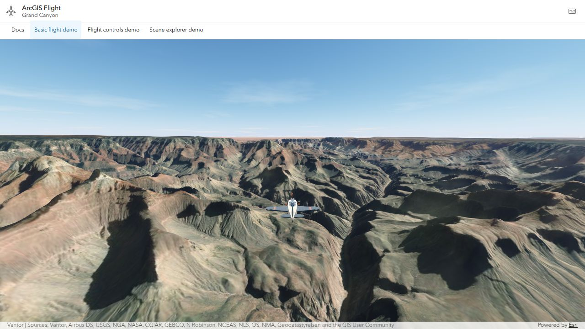
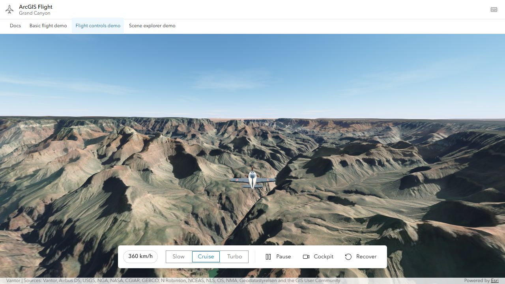
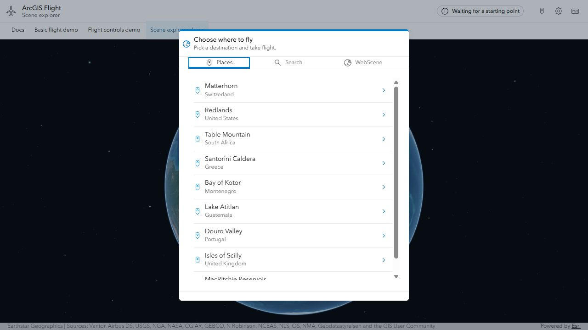
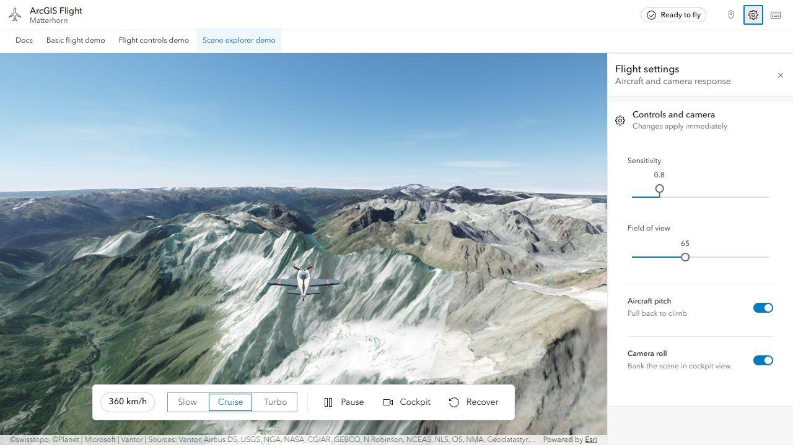

# Samples

The repository has four runnable examples, from a minimal integration to a
host application that selects and loads scenes.

| Sample | Local URL | Purpose |
| --- | --- | --- |
| [Basic flight demo](../demos/simple/) | `http://127.0.0.1:3116/demos/simple/` | Scene and aircraft with no component controls |
| [Flight controls demo](../demos/simple-controls/) | `http://127.0.0.1:3116/demos/simple-controls/` | Host-owned Calcite controls using public methods and events |
| [Scene explorer demo](../demos/webscene-selector/) | `http://127.0.0.1:3116/demos/webscene-selector/` | Scene selection, address search, and public WebScene loading |
| [SITG Enterprise demo](../demos/enterprise/) | `http://127.0.0.1:3116/demos/enterprise/` | Direct SITG imagery, elevation, and 3D services |

## Run the samples

```bash
npm install
npm run dev
```

Open `http://127.0.0.1:3116/` and use the top menu to switch between documentation
and samples. The samples use ArcGIS Maps SDK 5.1.24 and a
light Calcite theme with blue accents.

## Minimal Grand Canyon samples

Both minimal samples use a caller-owned scene and an explicit Grand Canyon
start pose:

```html
<arcgis-scene id="scene" basemap="satellite" ground="world-elevation"
  camera-position="-112.112, 36.099, 3200" camera-heading="95"
  camera-tilt="78" viewing-mode="global" popup-disabled></arcgis-scene>
<arcgis-plane-navigation reference-element="scene"
  start-longitude="-112.112" start-latitude="36.099"
  start-altitude-m="2600" start-heading-deg="95"></arcgis-plane-navigation>
```

Basic flight is the recommended first sample. Flight controls
mounts a host-owned Calcite toolbar from `demos/shared/flight-controls.ts`.
The component's own optional overlay is a separate feature:

```html
<arcgis-plane-navigation reference-element="scene" show-controls show-speed
  ui-position="bottom-end" ui-controls="power pause camera recover">
</arcgis-plane-navigation>
```

See [configuration recipes](configuration-recipes.md#add-the-optional-flight-overlay)
for overlay options. The host owns its map, view, and scene content; the flight
element removes only its own resources.

**Basic flight**



**Flight controls**



## Scene explorer



This host application keeps scene policy outside the reusable component. It
offers nine places using imagery and elevation, including eight starts from World Sky Tour,
public ArcGIS Online WebScene item IDs, and
address search through Esri's World Geocoding Service. It also demonstrates
loading feedback, layer warnings, safe map replacement, rollback, cancellation,
and a responsive Calcite settings panel.

The selector starts idle. After a choice, it creates or updates the caller-owned
`arcgis-scene`, waits for readiness, configures the flight start, and starts the
component. Failed activation returns to the previous working scene when
possible.

Open **Settings** to adjust sensitivity, field of view, pitch input, and camera roll.



For the reusable lifecycle and ownership contract, see [Getting started](getting-started.md)
and [Architecture](architecture.md). For a full host implementation, inspect
the [selector source](../demos/webscene-selector/main.ts).
