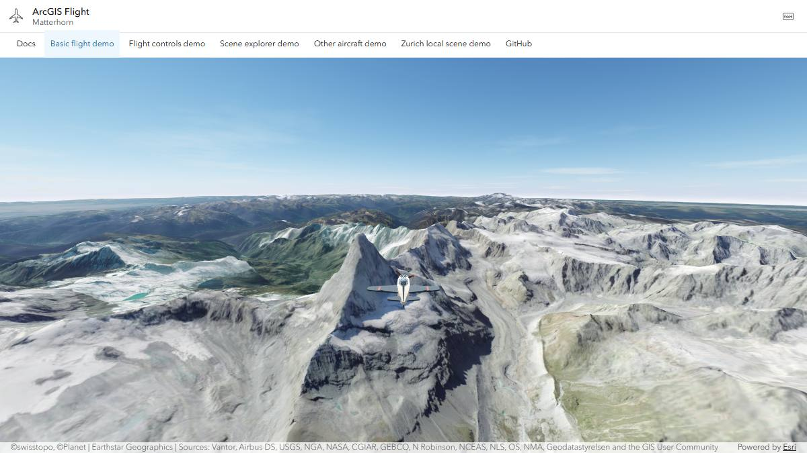
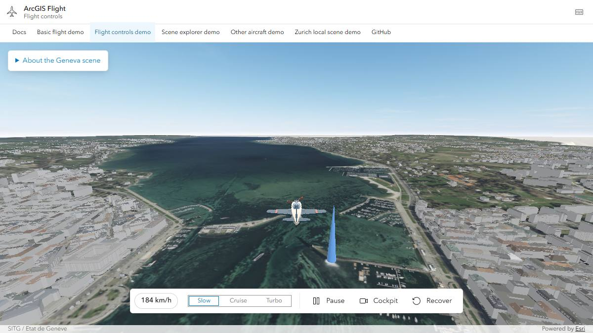
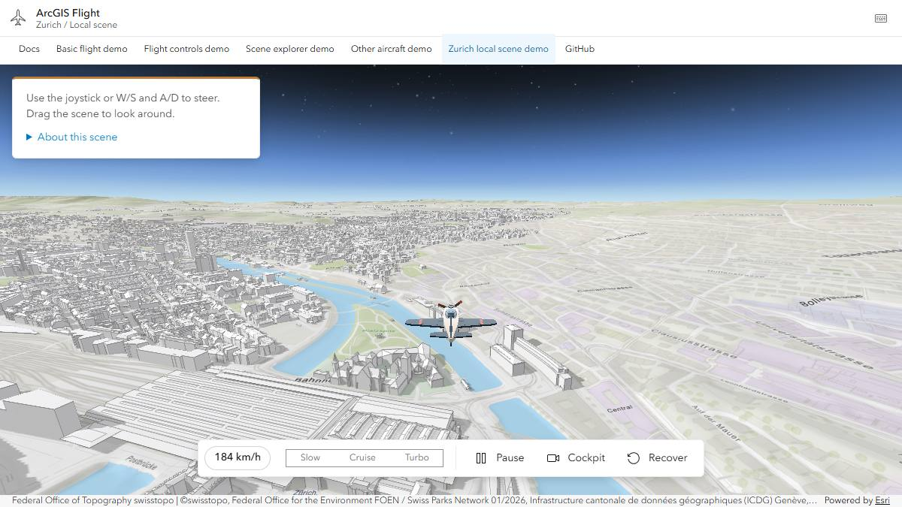
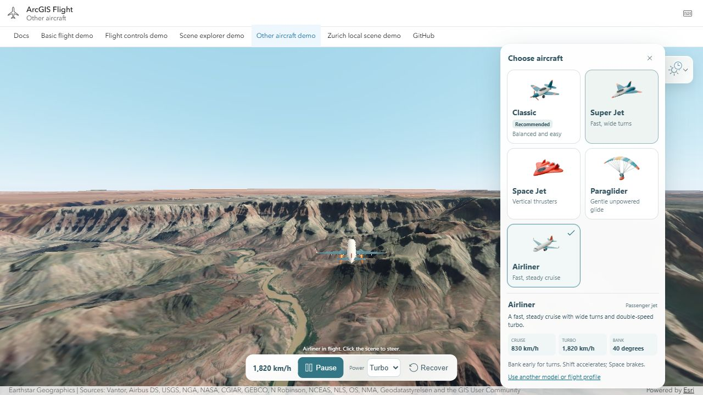
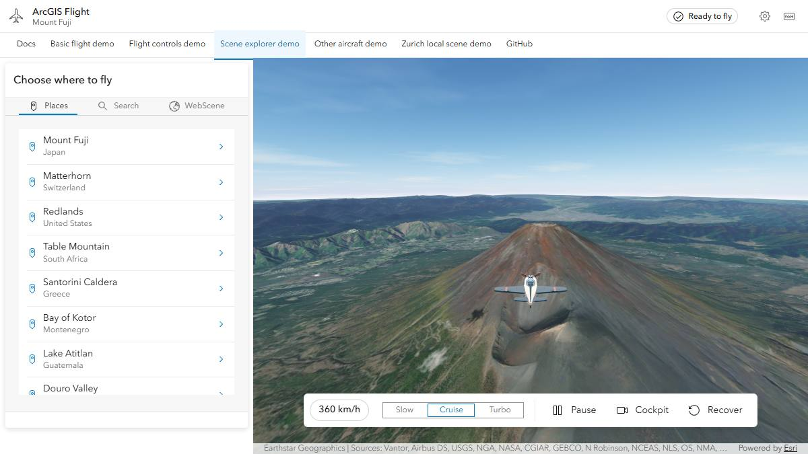

# Samples

Each sample is a small app you can open in the browser and read in full on
GitHub. Start with Basic flight: it is a single HTML file.

To run them on your machine, see [Run the samples locally](#run-the-samples-locally).

## Basic flight

[](../demos/simple/)

Fly toward the Matterhorn. The page is a scene and the flight component,
configured with HTML attributes only.

[Open the sample](../demos/simple/) · [View the source](../demos/simple/index.html)

```html
<arcgis-scene id="scene" basemap="satellite" ground="world-elevation"
  camera-position="7.71, 46.01, 5600" camera-heading="235" camera-tilt="78">
</arcgis-scene>

<arcgis-plane-navigation reference-element="scene"
  start-longitude="7.71" start-latitude="46.01"
  start-altitude-m="5200" start-heading-deg="235">
</arcgis-plane-navigation>
```

## Flight controls

[](../demos/simple-controls/)

Fly over Geneva with imagery, terrain, and 3D buildings from
[SITG](https://sitg.ge.ch/), Geneva's GIS. The app builds its map from ArcGIS
Enterprise and ArcGIS Online service URLs, then hands the scene to the
component. Its toolbar calls `setPowerMode()`, `pause()`, `setCameraMode()`,
and `recover()`.

[Open the sample](../demos/simple-controls/) · [View the source](../demos/simple-controls/main.ts)

```js
const map = new Map({
  basemap: new Basemap({ baseLayers: [new TileLayer({ url: imageryUrl })] }),
  ground: new Ground({ layers: [new ElevationLayer({ url: terrainUrl })] }),
  layers: [new SceneLayer({ url: buildingsUrl })],
});

scene.map = map;
await scene.viewOnReady();
flight.referenceElement = scene;
```

## Zurich local scene

[](../demos/zurich/)

Fly over a [WebScene](https://www.arcgis.com/home/item.html?id=067ada556ed84bb3aa5c65b4f2a7c15d)
that uses a local coordinate system, Swiss LV95 (EPSG:2056). The app creates
its own `SceneView` and assigns it to the component.

[Open the sample](../demos/zurich/) · [View the source](../demos/zurich/main.ts)

```js
const webscene = new WebScene({ portalItem: { id: "067ada556ed84bb3aa5c65b4f2a7c15d" } });
const view = new SceneView({ container: "scene", map: webscene });
await view.when();

flight.config = {
  start: { longitude: 8.54, latitude: 47.37, altitudeM: 650, headingDeg: 5, speedMps: 70 },
};
flight.view = view;
```

## Other aircraft

[](../demos/aircraft/)

Switch between five aircraft (Classic, Super Jet, Space Jet, Paraglider, and
Airliner) over the Grand Canyon without reloading the scene. The sample also
toggles Esri 3D buildings, changes the weather and time of day, and saves a photo.

[Open the sample](../demos/aircraft/) · [View the source](../demos/aircraft/main.ts)

```js
await flight.setAircraft({
  flight: { model: "super-jet" },
  assets: {
    bodyUrl: "models/fleet/super-jet.glb",
    boostUrl: "models/fleet/super-jet-boost.glb",
    propellerUrl: null,
  },
});
```

The models are in [`public/models/fleet`](../public/models/fleet/SOURCE.md).
See [Custom aircraft](custom-aircraft.md) to use your own.

## Scene explorer

[](../demos/webscene-selector/)

A larger app. Pick a place, search for an address, or load any public
WebScene from ArcGIS Online. It shows how to switch scenes while flying: stop
the flight, change the map, then start again.

[Open the sample](../demos/webscene-selector/) · [View the source](../demos/webscene-selector/main.ts)

```js
flight.stop();                       // puts the camera back
scene.map = nextWebScene;
await scene.viewOnReady();

flight.updateConfig({ start: nextStart });
await flight.start();
```

## Run the samples locally

```bash
git clone https://github.com/ceddc/arcgis-flight-component.git
cd arcgis-flight-component
npm ci
npm run dev
```

Open <http://127.0.0.1:3116/> and pick a sample from the menu. If port 3116 is
busy, Vite prints another address. The samples load the component from `src/`,
so your changes to the component show up right away.
